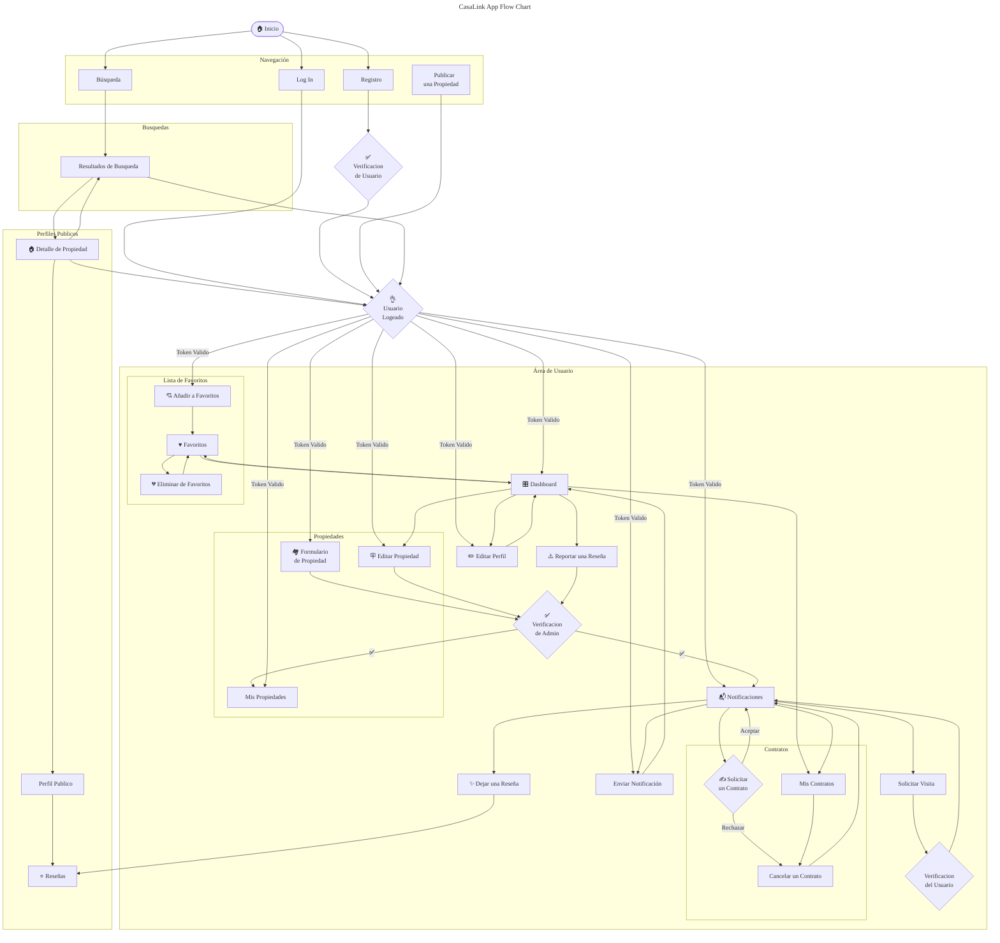

# Wireframes de CasaLink

## 1. Páginas Públicas

### 1.1 - Landing Page

-   **Hero Section**:
    -   Barra de búsqueda rápida (ubicación, precio, habitaciones) [🔗](#busqueda-rapida)
-   **Publicar Propiedad**:
    -   Mecanica de Publicacion [🔗](#mecanica)
    -   Botón "Publicar Propiedad"
-   **Propiedades Destacadas**:
    -   Grid con miniaturas (imagen, precio, ubicación, rating) [🔗](#propiedades-destacadas)
-   **Testimonios**:
    -   Reseñas de usuarios verificados [🔗](#testimonios)

|                         Desktop                          |                         Mobile                          |
| :------------------------------------------------------: | :-----------------------------------------------------: |
|  |  |

---

### 1.2 - Resultados de Búsqueda

-   **Filtros Avanzados** (sidebar):
    -   Rango de precios
    -   Número de habitaciones/baños
    -   Certificado energético
    -   Dueños con mejores valoraciones
-   **Listado de Propiedades**:
    -   Mapa interactivo [EXTRA]
    -   Cards con: imágenes, precio, ubicación, rating
    -   Botones "Ver Detalle" / "Añadir a Favoritos"

|                                  Desktop                                  |                                  Mobile                                  |
| :-----------------------------------------------------------------------: | :----------------------------------------------------------------------: |
|  |  |

### 1.3 - Detalle de Propiedad

-   **Galería de Imágenes** (carrusel + thumbnails)
-   **Información Básica**:
    -   Título, precio, ubicación exacta
    -   Botón "Añadir a Favoritos"
    -   Características (m², habitaciones, baños, etc.)
-   **Descripción Larga**
-   **Perfil del Propietario**:
    -   Avatar, nombre, rating.
-   **Formulario de Solicitud de Visita** (solo logged)

|                                Desktop                                |                                Mobile                                |
| :-------------------------------------------------------------------: | :------------------------------------------------------------------: |
|  |  |

---

## 2. Páginas de Usuario Registrado

### 2.4 - Dashboard General

-   **Resumen**:

    -   Numero de notificaciones pendientes y botón "Ver" (Si existen)
    -   Editar Perfil
    -   Estado de perfil (completo/verificado)
    -

-   **Acciones Rápidas**:

    -   "Publicar Propiedad"
    -   "Mis Propiedades"
    -   "Ver Favoritos"
    -   "Mis Contratos"

|                              Desktop                               |                              Mobile                               |
| :----------------------------------------------------------------: | :---------------------------------------------------------------: |
|  |  |

---

### 2.5 - Perfil de Usuario

-   **Perfil**:

    -   Avatar
    -   Nombre Completo

-   **Sección de Edición**: (Solo si es su perfil)

    -   Avatar uploader
    -   Campos: Nombre, teléfono, biografía
    -   Switch "Verificación de Identidad" (subir documentos)

-   **Reseñas**:

    -   Gráfico de rating promedio
    -   Tabs: "Reseñas Recibidas" / "Reseñas Escritas"

|                             Desktop                             |                             Mobile                             |
| :-------------------------------------------------------------: | :------------------------------------------------------------: |
|  |  |

---

### 2.6 - Mis Propiedades

-   **Listado de Propiedades**:

    -   Estado (pendiente, disponible, oculta, alquilada)
    -   Acciones: Editar, Ocultar, Ver Solicitudes

-   **Listado de Propiedades Favoritas**:

    -   Lista de propiedades
    -   Botón "Ver detalle"
    -   Botón "Eliminar de Favoritos"

|                            Desktop                             |                            Mobile                             |
| :------------------------------------------------------------: | :-----------------------------------------------------------: |
|  |  |

---

### 2.7 - Contratos y Visitas

-   **Visitas**:
    -   Listado de visitas
    -   Acciones: Aprobar / Modificar / Rechazar
-   **Contratos**:
    -   Fechas (inicio/fin)
    -   Status
    -   Acciones: Aprobar / Rechazar / zzCancelar
    -   Descargar en PDF (si existe) [EXTRA]
    -   Botón "Dejar Reseña" (si no existe ya)

|                               Desktop                                |                               Mobile                                |
| :------------------------------------------------------------------: | :-----------------------------------------------------------------: |
|  |  |

---

### 2.8 - Mis Notificaciones

-   **Lista Priorizada**:
    -   Solicitudes de visita (Acción: Aceptar/Rechazar)
    -   Aprobaciones/Rechazos de propiedades (Acción: Ver)
    -   Reseña (Acción: Enviar/Reportar)
    -   Aprobaciones/Rechazos/Cancelación/Vencimiento de contratos (Acción: Ver)

|                               Desktop                               |                               Mobile                               |
| :-----------------------------------------------------------------: | :----------------------------------------------------------------: |
|  |  |

---

## 3. Páginas de Administrador

### 3.9 - Panel de Control Admin

-   **Pendientes**:
    -   Listado de Propiedades pendientes de aprobación (Acción: Ver)
    -   Listado de Reseñas reportadas (Acción: Ver)
-   **Modal**:
    -   Comentario/Propiedad
    -   Botones "Aprobar" / "Rechazar" con campo de motivo

|                                  Desktop                                  |                                  Mobile                                  |
| :-----------------------------------------------------------------------: | :----------------------------------------------------------------------: |
|  |  |

---

## 4. Componentes Reutilizables

-   **Header**{#header-section}:
    -   Logo
    -   Navegación (Inicio, Acerca, Buscar, Publicar) [🔗](#navbar-section)
    -   Call-to-Action Button (Registro/Login)
    -   Iconos: Notificaciones, Perfil, Dashboard
-   **Mecanica de Publicacion** {#mecanica}
    -   3 pasos ilustrados (publicar, contactar, alquilar)
-   **Carrusel de Propiedades**{#propiedades-destacadas}
    -   Grid con miniaturas (imagen, precio, ubicación, rating)
-   **Testimonios**{#testimonios}
    -   Grid con Reseñas de usuarios verificados con 5 estrellas
-   **Footer**{#footer-section}:
    -   Sección de confianza (sellos de seguridad)
    -   Enlaces rápidos (FAQ, Soporte)
    -   Enlaces legales (Términos, Privacidad)
    -   Redes sociales [🔗](#redes-sociales)
-   **Modal Formulario de Login**:
    -   Campos: Email, Contraseña
    -   Enlace "¿Olvidaste tu contraseña?"
-   **Modal Formulario de Registro**:
    -   Campos: Nombre, Apellido, Email, Teléfono, Contraseña
    -   Checkbox "Acepto términos y condiciones"
-   **Modal Formulario de Nueva Propiedad**:
    -   Paso 1: Detalles (título, descripción, precio)
    -   Paso 2: Características (habitaciones, m², extras)
    -   Paso 3: Subir imágenes + certificados
-   **Modales Comunes**:
    -   Confirmación de acciones ("¿Eliminar de favoritos?")
    -   Sistema de rating (1-5 estrellas + comentario)
-   **Mapa Interactivo**:
    -   Mapa de las propiedades
    -   Botón "Ver en lista"
-   **Lista de Propiedades**:
    -   Lista de propiedades
    -   Botón "Ver detalle"
    -   Botón "Añadir a Favoritos" (Solo si es usuario) [EXTRA]
-   **Redes Sociales**{#redes-sociales}
    -   Enlaces a redes sociales
-   **Filtros Avanzados** (sidebar) {#filtros-avanzados}
    -   Rango de precios
    -   Número de habitaciones/baños
    -   Certificado energético
    -   Dueños con mejores valoraciones
-   **Estados Especiales**:
    -   Búsqueda sin resultados
    -   Perfil sin reseñas
    -   Propiedad pendiente de aprobación


---

## **Ejemplo de Estructura en Figma**

```plaintext
├─ 🎨 Landing Page
├─ 🔍 Resultados de Búsqueda
├─ 🏠 Detalle de Propiedad
├─ 📋 Dashboard General
├─ 👤 Perfil de Usuario
├─ 🏘️ Mis Propiedades
├─ 📝 Contratos y Visitas
├─ 📢 Mis Notificaciones
└─ ⚙️ Panel de Control Admin
```

## Diagrama de Flujo de CasaLink



[Editable](https://www.mermaidchart.com/app/projects/200af6bf-3c37-4c2d-add5-860745724187/diagrams/11bf6451-0d0b-4877-b6d5-2bf1ad23d2a9/version/v0.1/edit)
