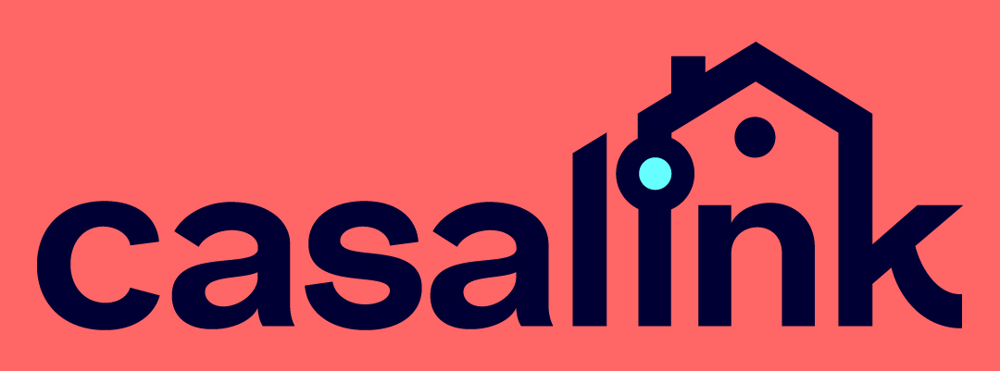
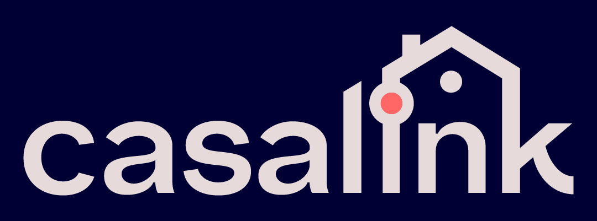
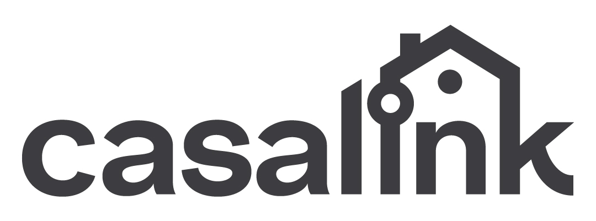
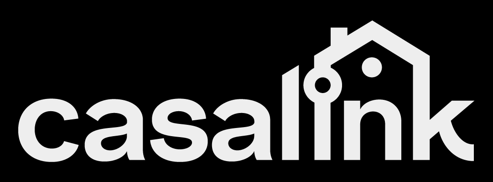
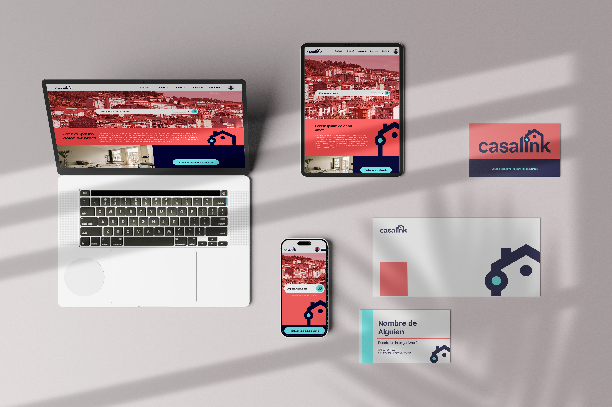

# Manual de Marca: CasaLink
*Versión 1.0*

---

## 1. Identidad de la Marca
### Misión
Conectar a inquilinos y propietarios de manera segura y eficiente, garantizando transparencia y confianza en el proceso de alquiler.

### Visión
Ser la plataforma líder en alquileres digitales, reconocida por su innovación, seguridad y enfoque centrado en el usuario.

---

## 2. Logo
### Descripción
El logo de **CasaLink** representa una casa minimalista construida con nodos de conexión, simbolizando:
- **Conexión**: Entre inquilinos y propietarios.
- **Tecnología**: La plataforma digital como base.
- **Hogar**: El objetivo final de cada usuario.

### Versiones del Logo
| Tipo                     | Uso Recomendado        | Ejemplo Visual (Descripción)                               |
|--------------------------|------------------------|------------------------------------------------------------|
| **Principal**            | Fondos rojos o claros. |       |
| **Invertido**            | Fondos oscuros.        |       |
| **Monocromatico Oscuro** |                        |  |
| **Monocromatico Claro**  |                        |  |

### Aplicaciones
- **Digital**: Favicon (16x16 px o 32x32 px), encabezados de redes sociales, banners web.
- **Impreso**: Tarjetas de presentación, papelería, folletos.
- **Merchandising**: Tazas, camisetas, llaveros (opcional).

### Restricciones
- **NO** distorsionar, rotar o alterar las proporciones.
- **NO** usar colores no aprobados en la paleta.
- **NO** colocar texto u otros elementos en el "espacio de respeto" (mínimo 10% del tamaño del logo).

---

## 3. Guía de Estilo
### Paleta de Colores
| Color               | Código HEX                                      | Uso Principal                                     |
|---------------------|-------------------------------------------------|---------------------------------------------------|
| **Rojo Principal**  | `#FF6666` ■ | Fondos y botones de acción.                       |
| **Azul Principal**  | `#000033` ■ | Textos destacados, botones secundarios, logo.     |
| **Cian Secundario** | `#66FFFF` ■ | Botones de acción secundarios o hovers.           |
| **Azul de Apoyo**   | `#202040` ■ | Textos secundarios, bordes, fondos.               |
| **Gris Azulado**    | `#3D3D40` ■ | Textos corridos.                                  |
| **Blanco Rojizo**   | `#E6DADA` ■ | Elementos de Apoyo y textos sobre fondos oscuros. |
| **Negro**           | `#111111` ■ |                                                   |
| **Blanco**          | `#EEEEEE` ■ |                                                   |

### **Tipografía**
| Tipo           | Fuente                                                                               | Uso Recomendado                                                      | Ejemplo                                                                                                        |
|----------------|--------------------------------------------------------------------------------------|----------------------------------------------------------------------|----------------------------------------------------------------------------------------------------------------|
| **Principal**  | Artlab         | Títulos, logotipo, textos destacados. Usar Montserrat en su defecto. | CasaLink.app          |
| **Respaldo**   | Montserrat | Párrafos, botones, textos informativos cuando falte Artlab.          | Respaldo          |
| **Secundaria** | Open Sans                                                                            | Párrafos, botones, textos informativos.                              | Donde inquilinos y propietarios se encuentran |

---

## 4. Redes Sociales
### Handles Oficiales
- **Instagram**: [@CasaLink.app](https://instagram.com/CasaLink.app)
- **Twitter**: [@CasaLink_app](https://twitter.com/CasaLink_app)
- **Facebook**: [CasaLink.app](https://facebook.com/CasaLink.app)

### Recomendaciones de Contenido
- Usar el **rojo principal** (#FF6666 ■) para fondos o elementos gráficos.
- Incluir el **eslogan** en publicaciones destacadas.
- Mantener un tono cercano y profesional, reflejando seguridad y confianza.

---

## 5. Eslogan
**"Donde inquilinos y propietarios se encuentran."**
- **Uso**:
  - En la página de inicio.
  - En pie de firma de correos electrónicos.
  - En campañas publicitarias y redes sociales.

---

## 6. Aplicaciones Prácticas
### Ejemplos de Uso
1. **Tarjeta de Presentación**:
   - **Frente**: Logo + nombre + eslogan.
   - **Reverso**: Información de contacto en Open Sans, fondo **Gris Azulado** (#3D3D40).

2. **Publicación en Instagram**:
   - **Imagen**: Foto de una casa con superposición del logo en blanco (esquina inferior derecha).
   - **Texto**: "¿Buscas alquilar con seguridad? 🏡 #CasaLink #HogarSeguro".

3. **Página Web**:
   - **Botones**: Rojo Principal (#FF666666) para acciones clave ("Buscar", "Publicar").
   - **Enlaces**: Azul de Apoyo (#202040) para hipervínculos.

---

## 7. Voz y Tono
- **Voz**:
  - **Confiable**: Transmite seguridad y transparencia.
  - **Moderna**: Refleja innovación tecnológica.
  - **Cercana**: Evita lenguaje técnico excesivo.
- **Tono**:
  - **Educado**: Para comunicaciones formales (ej: contratos).
  - **Amigable**: Para redes sociales y atención al usuario.

---

## 8. Adjuntos
En la carpeta `brandMediaKit` se encuentran los archivos de la marca, incluyendo:
- Logo en formatos: `.jpg`,`.svg`, `.png`.
- Tipografías en `.ttf`, `.otf`, `.woff`, `.woff2`.

---

Diseño realizado por [**ichik·studio**](https://ichikstudio.com "Creemos y creamos sueños").

**Contacto**: [info@ichikstudio.com](mailto:info@ichikstudio,com)

