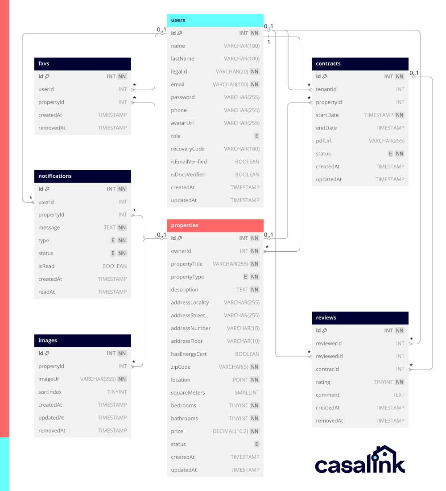

# Base de Datos - CasaLink

Estructura de la base de datos de CasaLink, una plataforma para la búsqueda y gestión de alquileres.

## Esquema de la Base de Datos

# 📘 Estructura de la Base de Datos - CasaLink

Este documento describe la estructura de la base de datos de **CasaLink**, especificando las tablas, sus campos y las relaciones entre ellas.

---

## 📂 Tablas y Estructura

### 📜 Tabla: `users`

| Campo           | Tipo         | Detalles                                         |
| --------------- | ------------ | ------------------------------------------------ |
| id 🔑           | INTEGER      | AUTOINCREMENT                                    |
| name            | VARCHAR(100) | Nombre del usuario                               |
| lastName        | VARCHAR(100) | Apellido del usuario                             |
| legalId         | VARCHAR(20)  | DNI, NIE, Pasaporte, etc.                        |
| email           | VARCHAR(100) | Único, NOT NULL                                  |
| password        | VARCHAR(255) | Hash de la contraseña                            |
| phone           | VARCHAR(255) | Teléfono de contacto                             |
| avatarUrl       | VARCHAR(255) | URL de la imagen de perfil                       |
| role            | ENUM         | Valores: user, admin, superadmin (default: user) |
| recoveryCode    | VARCHAR(100) | Código de recuperación (NULL por defecto)        |
| isEmailVerified | BOOLEAN      | FALSE por defecto                                |
| isDocsVerified  | BOOLEAN      | FALSE por defecto                                |
| createdAt       | TIMESTAMP    | CURRENT_TIMESTAMP por defecto                    |
| updatedAt       | TIMESTAMP    | CURRENT_TIMESTAMP por defecto                    |

📇 **Índices:** `(email, legalId, role)`

---

### 🏠 Tabla: `properties`

| Campo           | Tipo          | Detalles                                                            |
| --------------- | ------------- | ------------------------------------------------------------------- |
| id 🔑           | INTEGER       | AUTOINCREMENT                                                       |
| ownerId 🔗      | INTEGER       | users(id)                                                           |
| propertyTitle   | VARCHAR(255)  | NOT NULL                                                            |
| propertyType    | ENUM          | Valores: apartmento, casa, piso, duplex, otro                       |
| description     | TEXT          | NOT NULL                                                            |
| addressLocality | VARCHAR(255)  | Localidad                                                           |
| addressStreet   | VARCHAR(255)  | Calle                                                               |
| addressNumber   | VARCHAR(10)   | Número                                                              |
| addressFloor    | VARCHAR(10)   | Piso                                                                |
| hasEnergyCert   | BOOLEAN       | FALSE por defecto                                                   |
| zipCode         | VARCHAR(5)    | NOT NULL                                                            |
| location        | POINT         | Ubicación geográfica                                                |
| squareMeters    | SMALLINT      | Metros cuadrados                                                    |
| bedrooms        | TINYINT       | Número de habitaciones                                              |
| bathrooms       | TINYINT       | Número de baños                                                     |
| price           | DECIMAL(10,2) | Precio                                                              |
| status          | ENUM          | Valores: available, unavailable, rented, pending (default: pending) |
| createdAt       | TIMESTAMP     | CURRENT_TIMESTAMP por defecto                                       |
| updatedAt       | TIMESTAMP     | CURRENT_TIMESTAMP por defecto                                       |

📇 **Índices:** `(addressLocality, zipCode, price, status)`

---

### 📄 Tabla: `contracts`

| Campo         | Tipo         | Detalles                                                |
| ------------- | ------------ | ------------------------------------------------------- |
| id 🔑         | INTEGER      | AUTOINCREMENT                                           |
| tenantId 🔗   | INTEGER      | users(id)                                               |
| propertyId 🔗 | INTEGER      | properties(id)                                          |
| startDate     | TIMESTAMP    | Fecha de inicio                                         |
| endDate       | TIMESTAMP    | Fecha de finalización (NULL por defecto)                |
| pdfUrl        | VARCHAR(255) | URL del contrato en PDF (NULL por defecto)              |
| status        | ENUM         | pending, approved, rejected, ongoing, finished,canceled |
| createdAt     | TIMESTAMP    | CURRENT_TIMESTAMP por defecto                           |
| updatedAt     | TIMESTAMP    | CURRENT_TIMESTAMP por defecto                           |

📇 **Índices:** `(tenantId, propertyId, startDate, endDate, status)`

---

### ⭐ Tabla: `reviews`

| Campo         | Tipo      | Detalles                      |
| ------------- | --------- | ----------------------------- |
| id 🔑         | INTEGER   | AUTOINCREMENT                 |
| reviewerId 🔗 | INTEGER   | users(id)                     |
| reviewedId 🔗 | INTEGER   | users(id)                     |
| contractId 🔗 | INTEGER   | contracts(id)                 |
| rating        | TINYINT   | Puntuación (1-5)              |
| comment       | TEXT      | Comentario                    |
| createdAt     | TIMESTAMP | CURRENT_TIMESTAMP por defecto |
| removedAt     | TIMESTAMP | NULL por defecto              |

📇 **Índices:** `(reviewerId, reviewedId, contractId, rating)`

---

pending, approved, rejected, ongoing, finished,canceled
requested, approved, rejected

### 🖼️ Tabla: `images`

| Campo         | Tipo         | Detalles                      |
| ------------- | ------------ | ----------------------------- |
| id 🔑         | INTEGER      | AUTOINCREMENT                 |
| propertyId 🔗 | INTEGER      | properties(id)                |
| imageUrl      | VARCHAR(255) | NOT NULL                      |
| sortIndex     | TINYINT      | Orden de la imagen            |
| createdAt     | TIMESTAMP    | CURRENT_TIMESTAMP por defecto |
| updatedAt     | TIMESTAMP    | CURRENT_TIMESTAMP por defecto |
| removedAt     | TIMESTAMP    | NULL por defecto              |

📇 **Índices:** `sortIndex`

---

### ❤️ Tabla: `favs`

| Campo         | Tipo      | Detalles                      |
| ------------- | --------- | ----------------------------- |
| id 🔑         | INTEGER   | AUTOINCREMENT                 |
| userId 🔗     | INTEGER   | users(id)                     |
| propertyId 🔗 | INTEGER   | properties(id)                |
| createdAt     | TIMESTAMP | CURRENT_TIMESTAMP por defecto |
| removedAt     | TIMESTAMP | NULL por defecto              |

📇 **Índices:** `(userId, propertyId) UNIQUE`

---

### 🔔 Tabla: `notifications`

| Campo         | Tipo      | Detalles                          |
| ------------- | --------- | --------------------------------- |
| id 🔑         | INTEGER   | AUTOINCREMENT                     |
| userId 🔗     | INTEGER   | users(id)                         |
| propertyId 🔗 | INTEGER   | properties(id)                    |
| message       | TEXT      | NOT NULL                          |
| type          | ENUM      | visit, property, review, contract |
| status        | ENUM      | requested, approved, rejected     |
| isRead        | BOOLEAN   | FALSE por defecto                 |
| createdAt     | TIMESTAMP | CURRENT_TIMESTAMP por defecto     |
| readAt        | TIMESTAMP | NULL por defecto                  |

📇 **Índices:** `(userId, propertyId, type, status)`

---

📌 **Nota:** Se han aplicado restricciones y claves foráneas con cascada para asegurar la integridad de los datos.
