name: inicio
class: center, middle, red-bg

.first-slide-logo[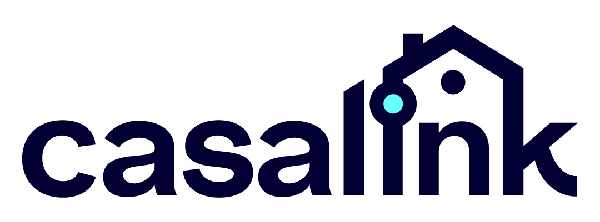]

---

background-image: url(..//media/casalink_casa-graphic_600x200.png)

name: que-es

.left-column[

## Que es

]

.right-column[

## 🚀 ¿Qué es CasaLink?

**CasaLink** es una plataforma web de búsqueda de **Alquiler Seguro**. Conecta a inquilinos y propietarios, proporcionando un sistema de valoraciones basado en experiencias anteriores para garantizar transparencia y confianza en el proceso de alquiler.

]

---

background-image: url(..//media/casalink_casa-graphic_600x200.png)

name: objetivos

.left-column[

## Que es

## Objetivos

]

.right-column[

## 🎯 Objetivos del Proyecto

-   Crear e implementar una **base de datos MySQL**.
-   Construir una **API** con Express.js y conectar la API a la base de datos.
-   Crear un **Front End** moderno y usable.
-   Respetar buenas prácticas de desarrollo.
-   Ejecutar un plan de pruebas para garantizar calidad.
    ]

---

background-image: url(..//media/casalink_casa-graphic_600x200.png)

.left-column[

## Que es

## Objetivos

## Tecnologías

]

.right-column[

## 🚀 Tecnologías Utilizadas

-   **Frontend**: React.js
-   **Backend**: Node.js, Express.js
-   **Base de Datos**: MySQL
-   **Autenticación**: JWT (JSON Web Tokens)
-   **Estilos**: CSS3
-   **Herramientas**: Git, GitHub, Postman
    ]

---

background-image: url(..//media/casalink_casa-graphic_600x200.png)

.left-column[

## Que es

## Objetivos

## Tecnologías

## Funciones

]

.right-column[

## 📌 Funcionalidades Clave

### ✅ Registro y Autenticación

-   Registro de usuarios (inquilinos y propietarios)
-   Inicio de sesión con JWT
-   Verificación de identidad mediante documentación

]

---

background-image: url(..//media/casalink_casa-graphic_600x200.png)

.left-column[

## Que es

## Objetivos

## Tecnologías

## Funciones

]

.right-column[

## 📌 Funcionalidades Clave

### 🏠 Gestión de Propiedades

-   Publicación de anuncios de alquiler
-   Modificación y eliminación de propiedades
-   Gestión del estado de las propiedades (disponible, alquilado, pendiente)

]

---

background-image: url(..//media/casalink_casa-graphic_600x200.png)

.left-column[

## Que es

## Objetivos

## Tecnologías

## Funciones

]

.right-column[

## 📌 Funcionalidades Clave

### 📜 Contratos y Seguridad

-   Creación y almacenamiento de contratos de alquiler
-   Descarga de contratos en formato PDF
-   Historial de contratos anteriores

]

---

background-image: url(..//media/casalink_casa-graphic_600x200.png)

.left-column[

## Que es

## Objetivos

## Tecnologías

## Funciones

]

.right-column[

## 📌 Funcionalidades Clave

### ⭐ Reseñas y Valoraciones

-   Evaluaciones de inquilinos y propietarios
-   Sistema de calificación basado en experiencias reales

]

---

background-image: url(..//media/casalink_casa-graphic_600x200.png)

.left-column[

## Que es

## Objetivos

## Tecnologías

## Funciones

]

.right-column[

## 📌 Funcionalidades Clave

### 🔔 Notificaciones

-   Alertas sobre solicitudes de visita
-   Confirmaciones y rechazos de alquiler
-   Recordatorios de contratos

]

---

background-image: url(..//media/casalink_casa-graphic_600x200.png)

.left-column[

## Que es

## Objetivos

## Tecnologías

## Funciones

## Estructura

]

.right-column[

## 📂 Estructura del Proyecto

```sh
CasaLink/
├── client/    # Código del cliente (React.js)
├── database/  # Scripts de la base de datos
├── docs/      # Documentación
├── server/    # Código del servidor (Node.js, Express)
├── LICENSE    # Licencia
├── README.md  # Este archivo
```

]

---

background-image: url(..//media/casalink_casa-graphic_600x200.png)

.left-column[

## Que es

## Objetivos

## Tecnologías

## Funciones

## Estructura

## Instalación

]

.right-column[

## 🛠 Instalación y Configuración

### 1️⃣ Clonar el repositorio

```sh
git clone https://github.com/johnatanmoran/CasaLink.git
cd CasaLink
```

]

---

background-image: url(..//media/casalink_casa-graphic_600x200.png)

.left-column[

## Que es

## Objetivos

## Tecnologías

## Funciones

## Estructura

## Instalación

]

.right-column[

## 🛠 Instalación y Configuración

### 2️⃣ Configurar el backend

```sh
cd server
cp .env.example .env # Configurar variables de entorno
npm install
npm run dbinit
npm run dev
```

]

---

background-image: url(..//media/casalink_casa-graphic_600x200.png)

.left-column[

## Que es

## Objetivos

## Tecnologías

## Funciones

## Estructura

## Instalación

]

.right-column[

## 🛠 Instalación y Configuración

### 3️⃣ Configurar el frontend

```sh
cd client
npm install
npm start
```

]

---

background-image: url(..//media/casalink_casa-graphic_600x200.png)

.left-column[

## Que es

## Objetivos

## Tecnologías

## Funciones

## Estructura

## Instalación

## Equipo

]

.right-column[

## 👾 Equipo de Desarrollo

.center[
[.avatar[]](https://github.com/Dav993 "@Dav993") [.avatar[]](https://github.com/JaviScavuzzo "@JaviScavuzzo") [.avatar[]](https://github.com/johnatanmoran "@johnatanmoran") [.avatar[]](https://github.com/Ken-Russel "@Ken-Russel") [.avatar[]](https://github.com/sergilh "@sergilh")
]

]

---

background-image: url(..//media/casalink_casa-graphic_600x200.png)

.left-column[

## Que es

## Objetivos

## Tecnologías

## Funciones

## Estructura

## Instalación

## Equipo

## Licencia

]

.right-column[

## 📄 Licencia

Este proyecto está bajo la licencia MIT.

**"Donde inquilinos y propietarios se encuentran."**

]

---

name: wireframe
class: center, middle, red-bg
background-image: url(..//media/casalink_casa-graphic_600x200.png)

## Wireframes

---

background-image: url(..//media/casalink_casa-graphic_600x200.png)

.left-column[

### Landing

]

.right-column[

#### Hero Section:

-   Barra de búsqueda rápida
    -   Campos: Ubicación, Habitaciones, Baños
    -   Boton **BUSCAR 🔎**

#### Publicar Propiedad:

-   Infografia de la Mecanica de Publicacion
-   Botón "Publicar Propiedad"
    ]

---

background-image: url(..//media/casalink_casa-graphic_600x200.png)

.left-column[

### Landing

]

.right-column[

#### Propiedades Destacadas:

-   Grid con miniaturas (Imagen, Precio, Ubicación, Rating)

#### Testimonios:

-   Reseñas de usuarios verificados

]

---

background-image: url(..//media/casalink_casa-graphic_600x200.png)

.left-column[

### Landing

]

.right-column[

    |                           Desktop                            |                           Mobile                            |
    |:------------------------------------------------------------:|:-----------------------------------------------------------:|
    |  | 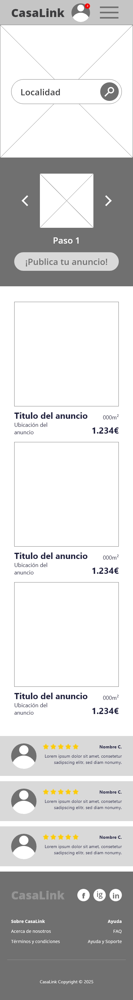 |

]

---

background-image: url(..//media/casalink_casa-graphic_600x200.png)

.left-column[

### Landing

### Búsqueda

]

.right-column[

#### Filtros Avanzados (sidebar)

-   Rango de precios
-   Número de habitaciones/baños
-   Certificado energético
-   Dueños con mejores valoraciones

#### Listado de Propiedades:

-   Mapa interactivo [EXTRA]
-   Cards con: imágenes, precio, ubicación, rating
-   Botones "Ver Detalle" / "Añadir a Favoritos"

]

---

background-image: url(..//media/casalink_casa-graphic_600x200.png)

.left-column[

### Landing

### Búsqueda

]

.right-column[

|                                   Desktop                                   |                                   Mobile                                   |
| :-------------------------------------------------------------------------: | :------------------------------------------------------------------------: |
| 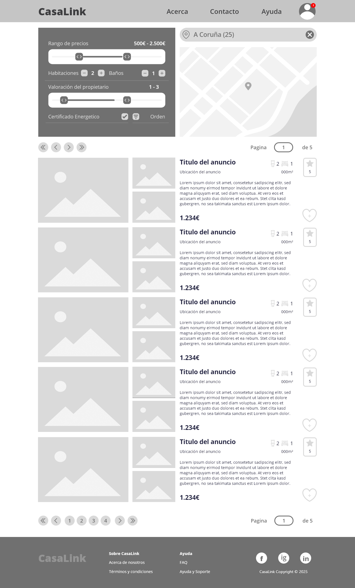 | 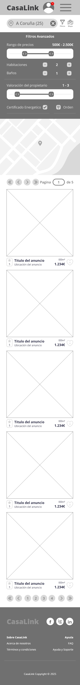 |

]

---

background-image: url(..//media/casalink_casa-graphic_600x200.png)

.left-column[

### Landing

### Búsqueda

### Detalles

]

.right-column[

#### Galería de Imágenes

-   Carrusel y thumbnails

#### Información

-   Título, precio, ubicación exacta
-   Botón "Añadir a Favoritos"
-   Características (m², habitaciones, baños, etc.)
-   Perfil del Propietario
    -   Avatar, nombre, rating.
-   Formulario de Solicitud de Visita (solo logged)
-   Descripción Larga
-   Ubicación en el mapa

]

---

background-image: url(..//media/casalink_casa-graphic_600x200.png)

.left-column[

### Landing

### Búsqueda

### Detalles

]

.right-column[
| Desktop | Mobile |
|:-------------------------------------------------------------------------:|:------------------------------------------------------------------------:|
|  | 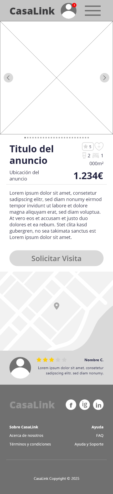 |

]

---

background-image: url(..//media/casalink_casa-graphic_600x200.png)

.left-column[

### Landing

### Búsqueda

### Detalles

### Dashboard

]

.right-column[

#### Resumen:

-   Estado de perfil (completo/verificado)
-   Numero de notificaciones pendientes y botón "Ver" (Si existen)
-   Editar Perfil

#### Acciones Rápidas:

-   Publicar Propiedad
-   Mis Propiedades
-   Ver Favoritos
-   Mis Contratos

]

---

background-image: url(..//media/casalink_casa-graphic_600x200.png)

.left-column[

### Landing

### Búsqueda

### Detalles

### Dashboard

]

.right-column[
| Desktop | Mobile |
|:----------------------------------------------------------------------:|:---------------------------------------------------------------------:|
| 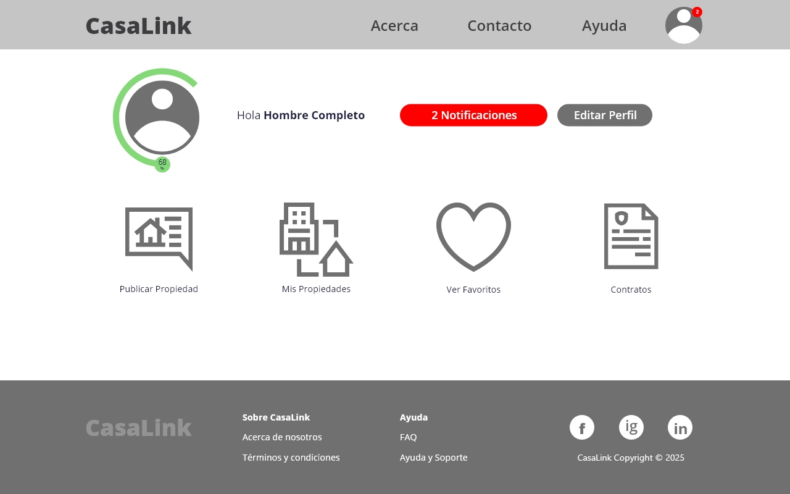 | 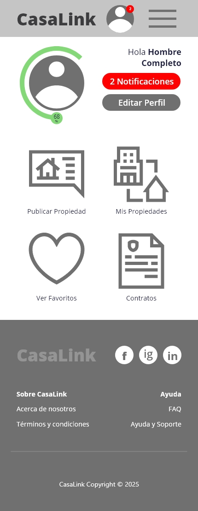 |

]

---

background-image: url(..//media/casalink_casa-graphic_600x200.png)

.left-column[

### Landing

### Búsqueda

### Detalles

### Dashboard

### Perfil

]

.right-column[

#### Perfil:

-   Avatar
-   Nombre Completo

#### Sección de Edición: (Solo en perfil propio)

-   Avatar uploader
-   Campos: Nombre, teléfono, biografía
-   Verificación de Identidad

#### Reseñas:

-   Gráfico de rating promedio
-   Tabs: "Reseñas Recibidas" / "Reseñas Escritas"

]

---

background-image: url(..//media/casalink_casa-graphic_600x200.png)

.left-column[

### Landing

### Búsqueda

### Detalles

### Dashboard

### Perfil

]

.right-column[
| Desktop | Mobile |
|:-------------------------------------------------------------------:|:------------------------------------------------------------------:|
| 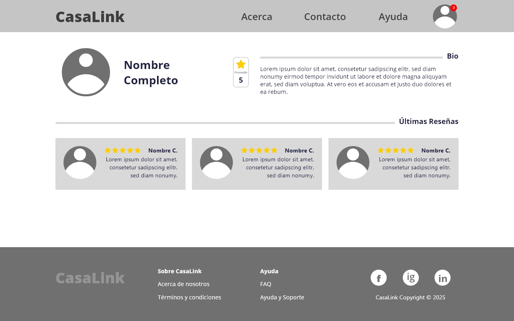 | 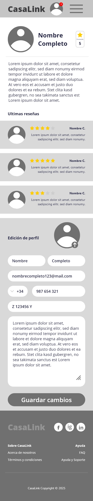 |

]

---

background-image: url(..//media/casalink_casa-graphic_600x200.png)

.left-column[

### Landing

### Búsqueda

### Propiedad

### Dashboard

### Perfil

### Propiedades

]

.right-column[

#### Listado de Propiedades:

-   Estado (pendiente, disponible, oculta, alquilada)
-   Acciones: Editar, Ocultar, Ver Solicitudes

#### Listado de Propiedades Favoritas:

-   Lista de propiedades
-   Botón "Ver detalle"
-   Botón "Eliminar de Favoritos"

]

---

background-image: url(..//media/casalink_casa-graphic_600x200.png)

.left-column[

### Landing

### Búsqueda

### Propiedad

### Dashboard

### Perfil

### Propiedades

]

.right-column[

|                             Desktop                              |                             Mobile                              |
| :--------------------------------------------------------------: | :-------------------------------------------------------------: |
| 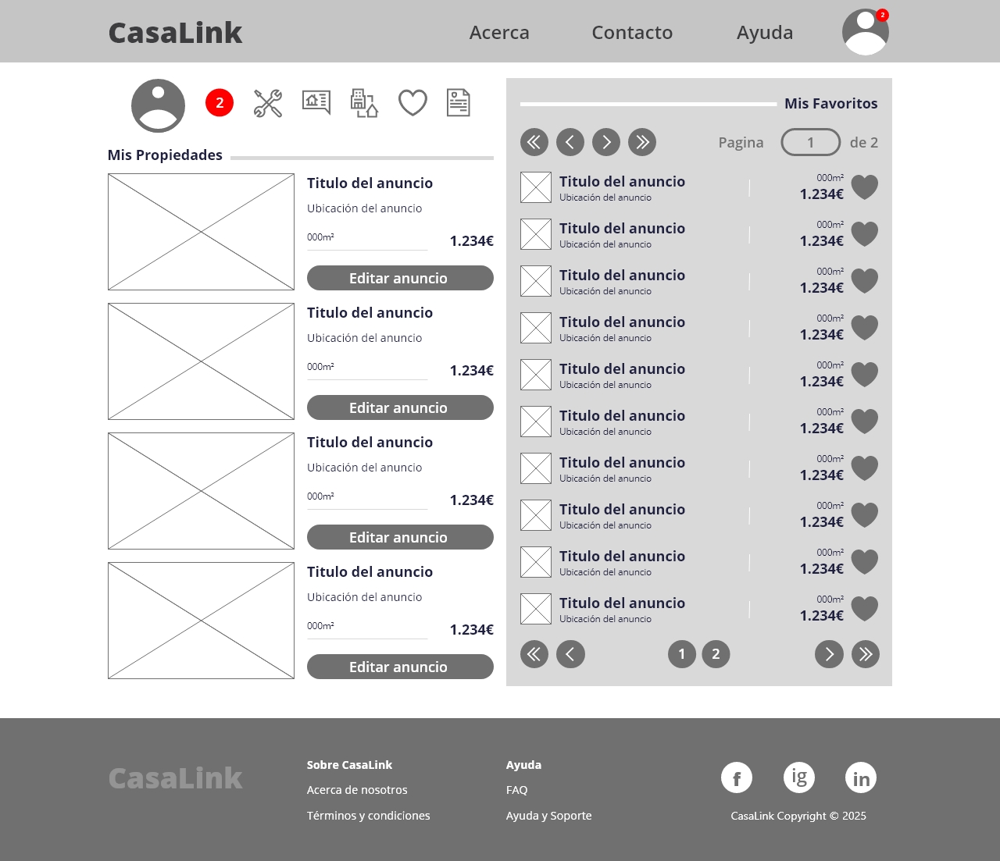 |  |

]

---

background-image: url(..//media/casalink_casa-graphic_600x200.png)

.left-column[

### Landing

### Búsqueda

### Propiedad

### Dashboard

### Perfil

### Propiedades

### Contratos

]

.right-column[

#### Visitas:

-   Listado de visitas
-   Acciones: Aprobar / Modificar / Rechazar

#### Contratos:

-   Fechas (inicio/fin)
-   Status
-   Acciones: Aprobar / Rechazar / zzCancelar
-   Descargar en PDF (si existe) [EXTRA]
-   Botón "Dejar Reseña" (si no existe ya)

]

---

background-image: url(..//media/casalink_casa-graphic_600x200.png)

.left-column[

### Landing

### Búsqueda

### Propiedad

### Dashboard

### Perfil

### Propiedades

### Contratos

]

.right-column[
| Desktop | Mobile |
|:------------------------------------------------------------------------:|:-----------------------------------------------------------------------:|
| 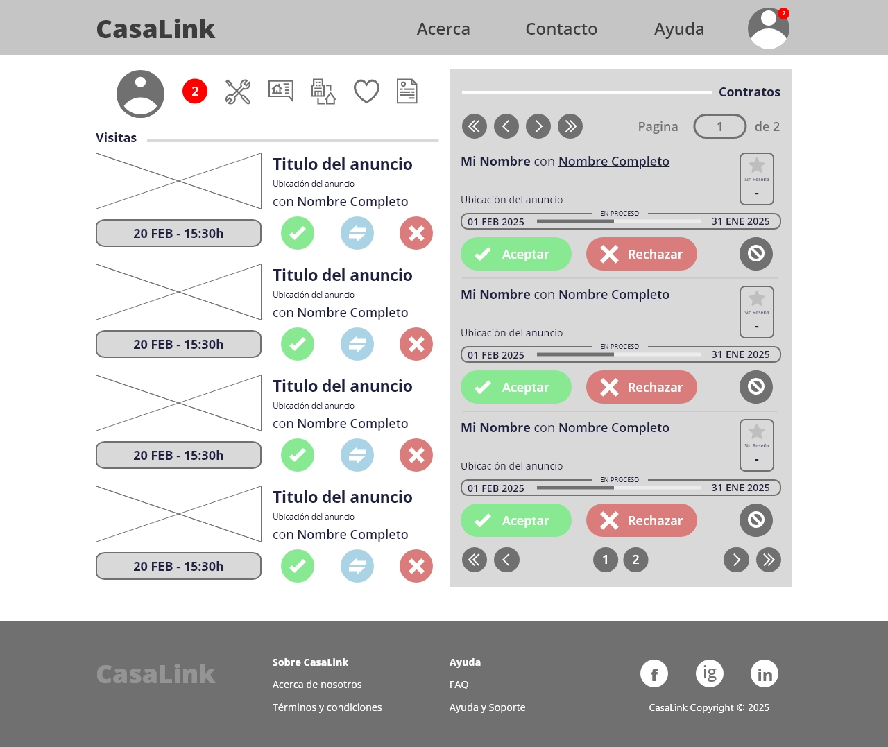 |  |

]

---

background-image: url(..//media/casalink_casa-graphic_600x200.png)

.left-column[

### Landing

### Búsqueda

### Propiedad

### Dashboard

### Perfil

### Propiedades

### Contratos

### Notificaciones

]

.right-column[

#### Lista Priorizada:

-   Solicitudes de visita (Acción: Aceptar/Rechazar)
-   Aprobaciones/Rechazos de propiedades (Acción: Ver)
-   Reseña (Acción: Enviar/Reportar)
-   Aprobaciones/Rechazos/Cancelación/Vencimiento de contratos (Acción: Ver)

]

---

background-image: url(..//media/casalink_casa-graphic_600x200.png)

.left-column[

### Landing

### Búsqueda

### Propiedad

### Dashboard

### Perfil

### Propiedades

### Contratos

### Notificaciones

]

.right-column[

|                                                                      |
| :------------------------------------------------------------------: |
|  |

]

---

background-image: url(..//media/casalink_casa-graphic_600x200.png)

.left-column[

### Landing

### Búsqueda

### Propiedad

### Dashboard

### Perfil

### Propiedades

### Contratos

### Notificaciones

### Admin

]

.right-column[

#### Pendientes:

-   Listado de Propiedades pendientes de aprobación (Acción: Ver)
-   Listado de Reseñas reportadas (Acción: Ver)

#### Modal:

-   Comentario/Propiedad
-   Botones "Aprobar" / "Rechazar" con campo de motivo

]

---

background-image: url(..//media/casalink_casa-graphic_600x200.png)

.left-column[

### Landing

### Búsqueda

### Propiedad

### Dashboard

### Perfil

### Propiedades

### Contratos

### Notificaciones

### Admin

]

.right-column[
| |
|:----------------------------------------------------------------------------:|
| 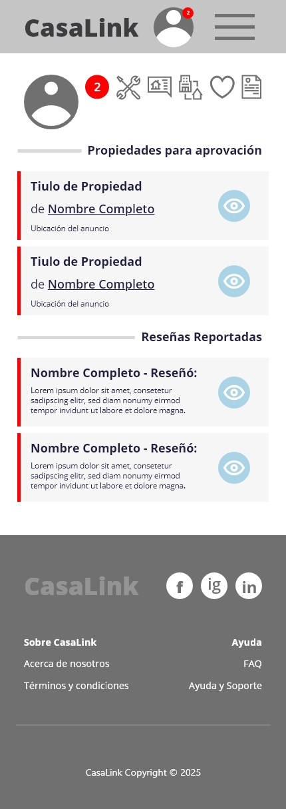 |

]

---

background-image: url(..//media/casalink_casa-graphic_600x200.png)

.left-column[

### Landing

### Búsqueda

### Propiedad

### Dashboard

### Perfil

### Propiedades

### Contratos

### Notificaciones

### Admin

## Componentes

]

.right-column[

#### Header:

-   Logo
-   Navegación (Inicio, Acerca, Buscar, Publicar) [🔗](#navbar-section)
-   Call-to-Action Button (Registro/Login)
-   Iconos: Notificaciones, Perfil, Dashboard

#### Filtros Avanzados

-   Rango de precios
-   Número de habitaciones/baños
-   Certificado energético
-   Dueños con mejores valoraciones

]

---

background-image: url(..//media/casalink_casa-graphic_600x200.png)

.left-column[

### Landing

### Búsqueda

### Propiedad

### Dashboard

### Perfil

### Propiedades

### Contratos

### Notificaciones

### Admin

## Componentes

]

.right-column[

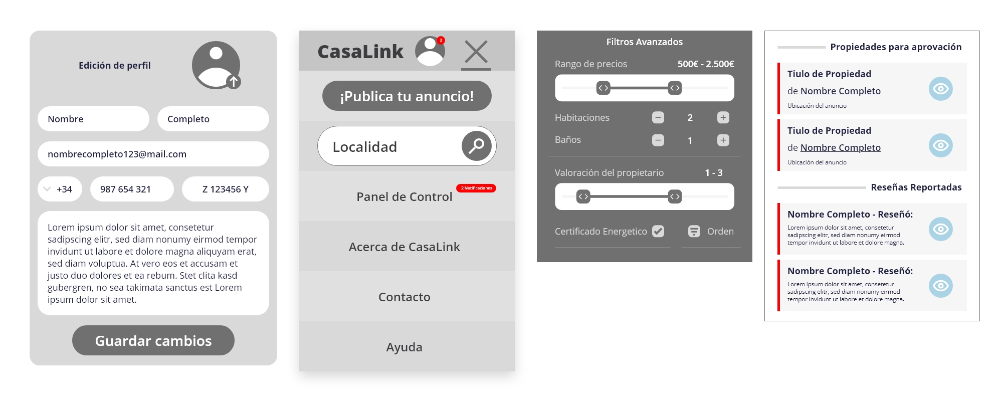

]

---

name: preguntas
class: center, middle, red-bg
background-image: url(..//media/casalink_casa-graphic_600x200.png)

.center[.text-size-h4[***"Ninguna pregunta es una pregunta tonta. La creatividad nace de la curiosidad."***]] .center[.text-size-h4[ —— Tony Robbins]]

---

name: gracias
class: center, middle, red-bg
background-image: url(..//media/casalink_casa-graphic_600x200.png)

.huge-text[**GRACIAS**]
